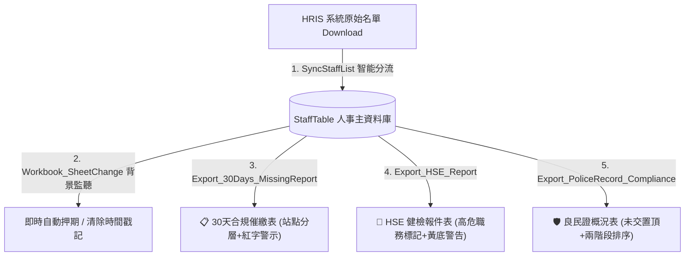

# 🚀 HR Onboarding & Compliance Automation System
**全自動化人事營運 (HR Ops) 與合規追蹤系統**

---

## 📖 專案概述 (Project Overview)
本專案透過 **Excel VBA** 打造全自動化的人事營運 (HR Ops) 與合規追蹤系統。核心解決大型企業或多廠區 (Multi-site) 在處理員工入職合規 (Onboarding Compliance)、健康與安全 (HSE) 體檢追蹤、以及人事主資料庫 (Master Data) 同步時面臨的繁瑣手動比對與人工登錄錯誤。

透過此自動化模組，HR 團隊能一鍵完成從資料同步、狀態連動到產出各類稽核報表的端到端 (End-to-End) 流程，大幅提升人事資料的準確度與管理效率。

---

## 🛠️ 系統架構與工作表 (System Architecture)
* **`StaffTable`**：人事主資料表 (Master Data)，存放所有員工的在職狀態、合規文件繳交進度與個人資訊。
* **`Download`**：由 HRIS 系統匯出之原始異動資料檔。
* **VBA 核心模組**：包含 4 個獨立業務報表/處理模組 (`.bas`)，以及 1 個全域事件監聽模組 (`.cls`)。

---

## 💻 技術堆疊 (Tech Stack)
* **核心語言**：VBA (Visual Basic for Applications)
* **核心技術應用**：
  * 工作表事件監聽 (`Worksheet_Change` Events)
  * 動態陣列、迴圈處理與範圍定位 (`Dynamic Ranges`, `Match`, `Intersect`)
  * 字串解析與重組 (`InStr`, `String Concatenation`)
  * 自動化條件式格式與 UI/UX 排版 (`PasteValidation`, `Interior.Color`)
  * 防呆與全域錯誤處理機制 (`ErrorHandler`, `ScreenUpdating = False`)

---

## 🚀 核心功能模組與程式碼展示 (Core Features & Code Highlights)

### 1. 人事主檔智能同步模組 (Staff List Synchronization)
* **對應檔案**：`SyncStaffList.bas` (Module2)
* **功能描述**：比對 `Download` 工作表（HRIS 匯出原始檔）與 `StaffTable`（人事主資料庫），以「員工編號」為 Key 進行全自動分流處理，精準識別「新進員工建檔」與「既有員工異動更新」。
* **自動化亮點**：
  * **智能分流與狀態初始化**：新進員工自動搬移基本資料 (A-K 欄)，批次將 10 項以上合規追蹤欄位 (M-R, U-X, AB-AE 欄) 預設為「未交」，並將報件紀錄 (T, Z 欄) 初始化為「待處理」。
  * **格式與公式動態繼承**：自動複製並延伸關鍵計算公式（AF 欄入職合規、AG 欄站點、AH 欄員編排序），並透過 `xlPasteValidation` 與 `xlPasteFormats` 完整繼承下拉選單資料驗證與條件格式。
  * **在職狀態智能判定**：依據第 11 欄（離職日期）是否存在數值，自動判定並寫入在職狀態（「在職」或「離職」）。
  * **效能優化與防錯設計**：批次處理前關閉螢幕更新 (`ScreenUpdating = False`) 與自動重算 (`xlCalculationManual`)，並加入 `ErrorHandler` 與防呆確認視窗，執行完畢後精確回報新進與更新筆數。

```vba
' 核心片段：SyncStaffList 智能分流與格式自動繼承邏輯
matchRow = Application.Match(wsDown.Cells(i, "A").Value, wsMaster.Columns("A"), 0)

If IsError(matchRow) Then
    ' =================================================================
    ' --- A. 處理新進員工 ---
    ' =================================================================
    lastRowMaster = wsMaster.Cells(wsMaster.Rows.Count, "A").End(xlUp).Row + 1
    
    ' 1. 搬運基本資料 (A~K 欄) 並自動判定在職狀態 (L 欄)
    For col = 1 To 11
        wsMaster.Cells(lastRowMaster, col).Value = wsDown.Cells(i, col).Value
    Next col
    wsMaster.Cells(lastRowMaster, 12).Value = IIf(wsDown.Cells(i, 11).Value <> "", "離職", "在職")
    
    ' 2. 批次初始化「未交」與「待處理」狀態
    wsMaster.Range("M" & lastRowMaster & ":R" & lastRowMaster).Value = "未交"
    wsMaster.Range("U" & lastRowMaster & ":X" & lastRowMaster).Value = "未交"
    wsMaster.Range("AB" & lastRowMaster & ":AE" & lastRowMaster).Value = "未交"
    wsMaster.Cells(lastRowMaster, "T").Value = "待處理"
    wsMaster.Cells(lastRowMaster, "Z").Value = "待處理"
    
    ' 3. 動態繼承公式 (AF 入職合規, AG 站點, AH 員編排序)
    wsMaster.Cells(2, "AF").Copy Destination:=wsMaster.Cells(lastRowMaster, "AF")
    wsMaster.Cells(2, "AG").Copy Destination:=wsMaster.Cells(lastRowMaster, "AG")
    wsMaster.Cells(2, "AH").Copy Destination:=wsMaster.Cells(lastRowMaster, "AH")
    
    ' 4. 繼承格式與下拉選單資料驗證 (Data Validation)
    wsMaster.Rows(2).Copy
    wsMaster.Rows(lastRowMaster).PasteSpecial Paste:=xlPasteFormats
    wsMaster.Range("M2:AE2").Copy
    wsMaster.Range("M" & lastRowMaster & ":AE" & lastRowMaster).PasteSpecial Paste:=xlPasteValidation
    
    newCount = newCount + 1
Else
    ' =================================================================
    ' --- B. 處理既有員工 (僅更新異動欄位) ---
    ' =================================================================
    For col = 6 To 11
        wsMaster.Cells(matchRow, col).Value = wsDown.Cells(i, col).Value
    Next col
    
    If wsDown.Cells(i, 11).Value <> "" Then wsMaster.Cells(matchRow, 12).Value = "離職"
    
    updateCount = updateCount + 1
End If
```
---

### 2. 即時狀態連動與日期戳記 (Event-Driven Auto-Date Stamp)
* **對應檔案**：`Workbook_SheetChange.cls` (ThisWorkbook)
* **功能描述**：透過活頁簿層級的事件監聽器 (`Workbook_SheetChange`)，在背景即時捕捉關鍵法規文件的狀態變更，實現「零人工作業感 (Zero-touch)」的自動押期與動態清除，杜絕手動輸入日期的時間誤差與人為遺漏。
* **自動化亮點**：
  * **雙向狀態與時間感知 (Bidirectional State Sync)**：精準監控良民證 (R 欄) 與健檢報告 (X 欄)。當狀態選擇為「已收」時，自動於相鄰欄位 (S/Y 欄) 押上當日系統日期 (`Date`)；若狀態被改回「未交」、「不適用」或清空，則自動同步清空日期 (`ClearContents`)，維持資料庫乾淨度。
  * **遞迴死循環防護 (Recursion & Event Control)**：在寫入日期前強制關閉事件監聽 (`Application.EnableEvents = False`)，處理完成後立即重啟，避免自身寫入操作重複觸發 Change 事件導致無窮迴圈與當機。
  * **大批次貼上防崩潰 (Batch Edit Protection)**：加入 `Target.CountLarge > 100` 門檻判斷，當使用者進行整列刪除或大範圍跨欄貼上時自動略過監聽，防止記憶體超載造成 Excel 凍結。
  * **分頁衝突隔離 (Sheet Isolation)**：主動排除自動產出的報表分頁（如 HSE 健檢報件表、良民證報件表、逾期未交清單），避免報表生成時與主檔監聽邏輯產生衝突。
  * **全域容錯恢復機制 (Resilient Error Handling)**：內建 `ErrorHandler` 機制，即便程式遭遇不可預期的執行錯誤，也能確保強制恢復 `EnableEvents = True`，避免 Excel 永久失去背景監聽功能。

```vba
' 核心片段：全域事件監聽、防卡死門檻與雙向日期戳記邏輯
Private Sub Workbook_SheetChange(ByVal Sh As Object, ByVal Target As Range)
    ' 1. 排除動態產出之報表分頁，避免事件衝突
    If Sh.Name = "HSE_健檢報件表" Or Sh.Name = "良民證報件表" Or Sh.Name = "逾期未交清單" Then Exit Sub
    
    ' 2. 大量異動防護 (超過 100 格略過，防止貼上時當機)
    If Target.CountLarge > 100 Then Exit Sub
    
    Dim cell As Range
    On Error GoTo ErrorHandler ' 防錯處理：確保不慎中斷也能恢復監聽
    
    ' 3. --- 良民證模組：監控 R 欄，於 S 欄寫入/清除日期 ---
    If Not Intersect(Target, Sh.Range("R:R")) Is Nothing Then
        Application.EnableEvents = False ' 暫停事件，防止無限遞迴
        For Each cell In Intersect(Target, Sh.Range("R:R"))
            If cell.Value = "已收" Then
                cell.Offset(0, 1).Value = Date
            ElseIf cell.Value = "未交" Or cell.Value = "不適用" Or cell.Value = "" Then
                cell.Offset(0, 1).ClearContents
            End If
        Next cell
        Application.EnableEvents = True
    End If

    ' 4. --- 健檢報告模組：監控 X 欄，於 Y 欄寫入/清除日期 ---
    If Not Intersect(Target, Sh.Range("X:X")) Is Nothing Then
        Application.EnableEvents = False
        For Each cell In Intersect(Target, Sh.Range("X:X"))
            If cell.Value = "已收" Then
                cell.Offset(0, 1).Value = Date
            ElseIf cell.Value = "未交" Or cell.Value = "不適用" Or cell.Value = "" Then
                cell.Offset(0, 1).ClearContents
            End If
        Next cell
        Application.EnableEvents = True
    End If

    Exit Sub

ErrorHandler:
    Application.EnableEvents = True ' 強制重啟事件監聽
End Sub
```

---

### 3. 新人入職 30 天合規催繳報表 (30-Days Missing Document Report)
* **對應檔案**：`Export_30Days_MissingReport.bas` (Module3)
* **功能描述**：針對入職滿 30 天且文件尚未齊全的在職人員，自動生成依「廠區/站點 (Site)」分組分層的視覺化催繳清單，精準攔截法規稽核紅線風險。
* **自動化亮點**：
  * **三重維度合規過濾 (Multi-Condition Audit Filter)**：結合「在職狀態 (`L 欄`)」、「合規非全齊標籤 (`AF 欄`)」與「時間差運算 (`DateDiff("d", E欄入職日, Date) >= 30`)」，全自動鎖定逾期高風險人員。
  * **暫存對照與原生高效排序 (Staging & Native Sorting)**：於工作表邊界 (AA/AB 欄) 暫存符合條件的資料行號與站點，調用 Excel 原生 `.Sort` 快速依站點遞增排序，兼顧執行效能與邏輯清晰度。
  * **動態站點視覺化分層 (Dynamic Site Boundary Grouping)**：掃描時即時捕捉站點切換邊界 (`targetSite <> lastSite`)，自動插入跨欄合併 (A~H 欄) 且帶有藍色底色 (`RGB(197, 217, 241)`) 的站點分隔列，便於各站點 HR 專員對接。
  * **10 項法規文件字串解析重組 (Defect String Concatenation)**：逐欄掃描 10 項法規文件（合約、身分證、銀行帳戶、學歷、良民證、利益衝突、資安、保密書、健檢、扶養親屬），動態組裝缺件字串並精準截除尾端符號 (`Left(missingList, Len - 2)`)，以醒目深紅字體 (`RGB(200, 0, 0)`) 標註。
  * **報表生命週期管理與環境清理 (Lifecycle & Memory Cleanup)**：執行前動態重建 `30天未交清單` 工作表；查無資料時即時跳出提示並釋放資源；執行後自動清除暫存輔助欄位 (`ClearContents`) 並還原系統重算狀態。

```vba
' 核心片段：逾期篩選、動態站點分隔列繪製與缺件字串重組
' 1. 三重條件篩選並暫存於 AA/AB 欄
For i = 2 To lastRow
    If Trim(wsMaster.Cells(i, "L").Value) = "在職" And _
       InStr(1, wsMaster.Cells(i, "AF").Value, "全齊") = 0 And _
       wsMaster.Cells(i, "AF").Value <> "" And _
       DateDiff("d", wsMaster.Cells(i, "E").Value, Date) >= 30 Then
        
        wsRep.Cells(rRow, 27).Value = i                     ' 暫存行號
        wsRep.Cells(rRow, 28).Value = wsMaster.Cells(i, "AG").Value ' 暫存站點
        rRow = rRow + 1
    End If
Next i

' 2. 依站點排序暫存清單
wsRep.Range("AA2:AB" & rRow - 1).Sort Key1:=wsRep.Range("AB2"), Order1:=xlAscending

' 3. 繪製站點分層標題與組裝缺件明細
For i = 2 To dataCount
    Dim mRow As Long: mRow = wsRep.Cells(i, 27).Value
    targetSite = wsRep.Cells(i, 28).Value
    
    ' 站點邊界切換時，插入藍色分隔列
    If targetSite <> lastSite Then
        With wsRep.Range("A" & rRow & ":H" & rRow)
            .Merge: .Value = IIf(targetSite = "", "未註記站點", targetSite)
            .Font.Bold = True: .HorizontalAlignment = xlCenter
            .Interior.Color = RGB(197, 217, 241)
        End With
        rRow = rRow + 1: lastSite = targetSite
    End If

    ' 掃描 10 項文件狀態並重組字串
    missingList = ""
    If Trim(wsMaster.Cells(mRow, "M").Value) = "未交" Then missingList = missingList & "合約, "
    If Trim(wsMaster.Cells(mRow, "N").Value) = "未交" Then missingList = missingList & "身分證, "
    If Trim(wsMaster.Cells(mRow, "R").Value) = "未交" Then missingList = missingList & "良民證, "
    If Trim(wsMaster.Cells(mRow, "X").Value) = "未交" Then missingList = missingList & "健檢報告, "
    If Len(missingList) > 0 Then missingList = Left(missingList, Len(missingList) - 2)

    ' 填入報表並標記法律紅線缺件
    wsRep.Cells(rRow, 1).Value = wsMaster.Cells(mRow, "A").Value
    wsRep.Cells(rRow, 2).Value = wsMaster.Cells(mRow, "B").Value
    wsRep.Cells(rRow, 5).Value = wsMaster.Cells(mRow, "E").Value
    wsRep.Cells(rRow, 6).Value = targetSite
    wsRep.Cells(rRow, 7).Value = missingList
    wsRep.Cells(rRow, 7).Font.Color = RGB(200, 0, 0)
    rRow = rRow + 1
Next i
```

---

### 4. HSE 入職健檢報件系統 (HSE Health Check Dispatch)
* **對應檔案**：`Export_HSE_Report.bas` (Module1)
* **功能描述**：專門為職安衛 (HSE) 團隊打造之自動化報件工具。自動自人事主檔中過濾「待處理」且「已收健檢報告」的新進名單，一鍵生成符合法規申報規格的標準化報件清單。
* **自動化亮點**：
  * **高風險/現場作業員智能識別 (Role-Based Tagging)**：利用 `InStr` 進行不區分大小寫的字串匹配 (`vbTextCompare`)，自動判定職稱 (第 10 欄) 是否包含 `"operator"`，並於專屬欄位自動標記 `V / X`，輔助 HSE 精準鎖定特殊健檢對象。
  * **雙重風險視覺化警示 (Dual-Layer Visual Alerts)**：
    * **離職高風險標記**：若新進人員於申報前已有離職日期 (第 11 欄)，系統自動將該資料列標記為全列螢光黃底 (`vbYellow`)，防止無效申報。
    * **特殊證照醒目標註**：自動檢核堆高機證照 (第 27 欄)，有證照者於備註欄以深紅色字體 (`RGB(200, 0, 0)`) 標註，強化工安列管。
  * **狀態推進與閉環管理 (State Progression & Closed-Loop)**：報表生成成功後，程式即時反寫人事主檔之報件狀態欄位（Z 欄由「待處理」更新為「已發送」），徹底避免重複報件或漏報。
  * **動態工作表重建與格式化 (Dynamic Template Generation)**：執行前自動重置並重建 `HSE_報件表` 工作表，自動繪製合併標題、格線、欄寬自適應 (`AutoFit`)，並針對特定欄位（如 Operator 欄）微調欄寬以達最佳視覺化呈現。

```vba
' 核心片段：HSE 條件過濾、高危職務判定、異常視覺標記與狀態閉環反寫
For i = 2 To lastRow
    ' 篩選條件：Z 欄(26) = "待處理" 且 Y 欄(25) 已有繳交日期
    If Trim(wsMaster.Cells(i, 26).Value) = "待處理" And wsMaster.Cells(i, 25).Value <> "" Then
        
        ' 1. 填入基礎個人資料
        wsRep.Cells(rRow, 1).Value = wsMaster.Cells(i, 1).Value   ' 員編
        wsRep.Cells(rRow, 2).Value = wsMaster.Cells(i, 2).Value   ' 姓名
        wsRep.Cells(rRow, 3).Value = wsMaster.Cells(i, 5).Value   ' 入職日期
        wsRep.Cells(rRow, 4).Value = wsMaster.Cells(i, 7).Value   ' 部門
        
        ' 2. 判定 Operator 職務屬性
        If InStr(1, wsMaster.Cells(i, 10).Value, "operator", vbTextCompare) > 0 Then
            wsRep.Cells(rRow, 5).Value = "V"
        Else
            wsRep.Cells(rRow, 5).Value = "X"
        End If
        
        ' 3. 風險警示 1：離職人員整列標示黃底警告
        If wsMaster.Cells(i, 11).Value <> "" Then
            wsRep.Range("A" & rRow & ":H" & rRow).Interior.Color = vbYellow
        End If
        
        ' 4. 風險警示 2：堆高機證照深紅字體提醒
        If wsMaster.Cells(i, 27).Value = "有" Then
            wsRep.Cells(rRow, 8).Value = "堆高機證照"
            wsRep.Cells(rRow, 8).Font.Color = RGB(200, 0, 0)
        End If

        ' 5. 主檔狀態閉環推進：標記為已發送
        wsMaster.Cells(i, 26).Value = "已發送"
        wsRep.Range("A" & rRow & ":H" & rRow).Borders.LineStyle = xlContinuous
        rRow = rRow + 1
    End If
Next i
```
---

### 5. 良民證繳交稽核概況 (Police Record Compliance Audit)
* **對應檔案**：`Export_PoliceRecord_Compliance_Report.bas` (Module4)
* **功能描述**：一鍵產出全公司員工背景調查 (Background Check / 良民證) 的合規稽核總覽報表。自動區隔在職員工之繳交狀態，並透過優先順序重排機制，提供管理層清晰的催繳追蹤依據。
* **自動化亮點**：
  * **雙階段優先級排序演算法 (Two-Pass Priority Scan)**：打破原始人事大表依員編或入職日排序的限制，採用兩階段掃描邏輯。第一輪強制將「【未交/催繳】」高風險人員置頂並整列標示紅色字體 (`vbRed`)；第二輪於下方填入「【已完成】」名單，並在兩組資料間自動插入空白列區隔，大幅提升稽核直覺性。
  * **模組化副程式解耦 (Decoupled Subroutine / DRY 原則)**：將跨欄位資料填寫邏輯抽象化封裝為獨立的 `FillData` 副程式，統一集中管理員編、姓名、入職日、站點與狀態之映射標準，消除重複代碼並大幅提升程式碼維護性。
  * **在職狀態精準過濾 (Active Workforce Filtering)**：嚴格鎖定在職員工 (`Trim(L 欄) = "在職"`)，自動排除離職人員數據干擾，確保合規稽核名單 100% 反映當前組織現況。
  * **動態日期格式化與報表美化 (Date Formatting & UI Polish)**：已收件人員之備註欄自動轉換繳交日期格式為標準化 `yyyy/mm/dd` 格式；報表自動配置灰色標題底色 (`RGB(220, 220, 220)`)、全格線繪製與欄寬自適應 (`AutoFit`)。

```vba
' 核心片段：兩階段優先級掃描、未交人員紅字置頂與 FillData 模組化調用
' --- 第一輪：先抓「未交」人員 (置頂並整列標紅) ---
For i = 2 To lastRow
    If Trim(wsMaster.Cells(i, 12).Value) = "在職" Then
        If wsMaster.Cells(i, 18).Value <> "已收" Then
            wsRep.Cells(rRow, 1).Value = "【未交/催繳】"
            wsRep.Cells(rRow, 1).Font.Color = vbRed
            Call FillData(wsRep, wsMaster, rRow, i)              ' 調用模組化填值副程式
            wsRep.Range("A" & rRow & ":G" & rRow).Font.Color = vbRed ' 未交者整行紅字警示
            rRow = rRow + 1
        End If
    End If
Next i

' 插入空行作為視覺區隔
rRow = rRow + 1

' --- 第二輪：抓「已收」人員 (排列於下方) ---
For i = 2 To lastRow
    If Trim(wsMaster.Cells(i, 12).Value) = "在職" Then
        If wsMaster.Cells(i, 18).Value = "已收" Then
            wsRep.Cells(rRow, 1).Value = "【已完成】"
            Call FillData(wsRep, wsMaster, rRow, i)
            rRow = rRow + 1
        End If
    End If
Next i

' --- 獨立填值副程式 (減少重複邏輯，統一映射標準) ---
Sub FillData(wsRep As Worksheet, wsMaster As Worksheet, rRow As Long, mRow As Long)
    wsRep.Cells(rRow, 2).Value = wsMaster.Cells(mRow, 1).Value  ' 員編 (A 欄)
    wsRep.Cells(rRow, 3).Value = wsMaster.Cells(mRow, 2).Value  ' 姓名 (B 欄)
    wsRep.Cells(rRow, 4).Value = wsMaster.Cells(mRow, 5).Value  ' 入職日 (E 欄)
    wsRep.Cells(rRow, 5).Value = wsMaster.Cells(mRow, 33).Value ' 站點 (AG 欄)
    wsRep.Cells(rRow, 6).Value = wsMaster.Cells(mRow, 18).Value ' 狀態 (R 欄)
    
    ' 若已繳交，備註欄自動格式化日期
    If wsMaster.Cells(mRow, 18).Value = "已收" Then
        wsRep.Cells(rRow, 7).Value = "繳交日: " & Format(wsMaster.Cells(mRow, 19).Value, "yyyy/mm/dd")
    End If
End Sub
```

---

## 📈 商業價值與效益 (Business Impact)
* **消除人為疏漏 (Error Reduction)**：透過防呆機制與自動化初始化，避免新進員工建檔時漏填合規追蹤欄位，確保 **100%** 的追蹤覆蓋率。
* **法遵風險管控 (Compliance Management)**：精準抓取「滿 30 天未交齊」及 HSE 特殊身分（操作員 / 堆高機），大幅降低企業面臨的勞檢與工安合規風險。
* **工時大幅節省 (Time-Saving)**：原先需耗時數小時跨表比對 (VLOOKUP)、手動上色與篩選的例行公事，縮短至 **單擊按鈕 (1-Click)** 於秒級內完成，釋放 HR 團隊行政量能。
